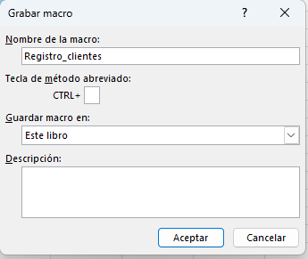
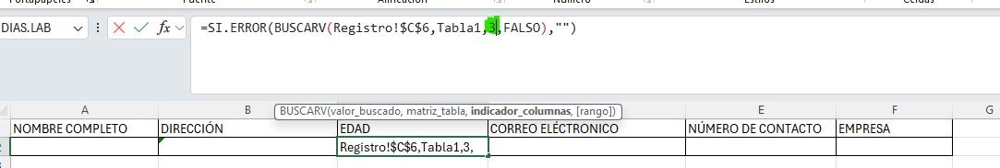
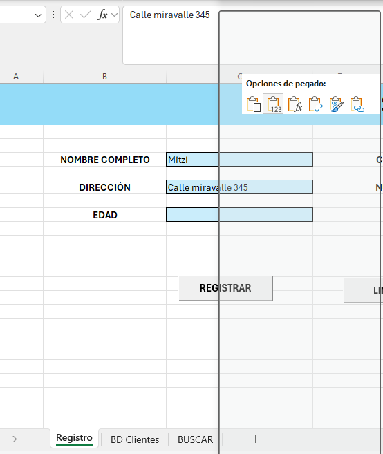
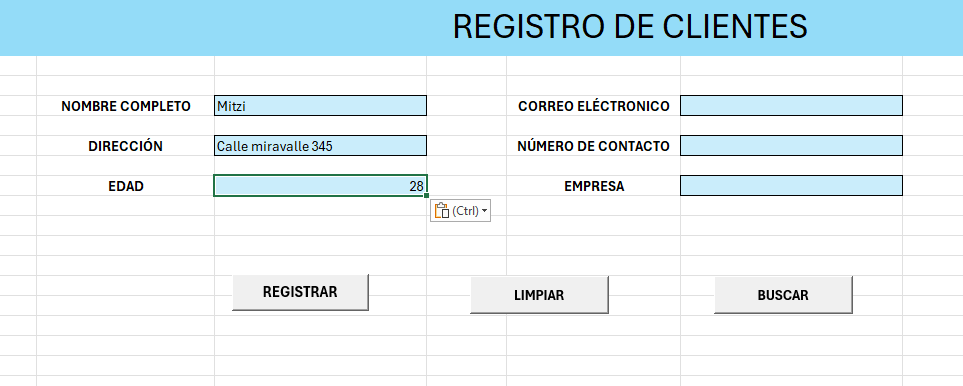

# Práctica 2. Sistema de registro de clientes con Macros

## 🎯 Objetivos:
Al finalizar la práctica, serás capaz de:
- Aplicar macros grabadas para automatizar la captura, almacenamiento y búsqueda de datos.
- Desarrollar un sistema funcional de entrada de datos sin programación (usando solo grabadora de macros).
- Usar botones de formulario para ejecutar macros asociadas.
- Consolidar la relación entre formularios de entrada y una base de datos en Excel.

## 🕒 Duración aproximada:
- 25 minutos.

---

**[⬅️ Atrás](https://netec-mx.github.io/EXL_ADV/Cap%C3%ADtulo1/)** | **[Lista General](https://netec-mx.github.io/EXL_ADV/)** | **[Siguiente ➡️](https://netec-mx.github.io/EXL_ADV/Cap%C3%ADtulo3/)**

---

## Instrucciones:

### Tarea 1. Realizar Macro para registrar a clientes.

Paso 1. Abre el archivo [Registro_de_clientes](<Registro de clientes.xlsm>).

Paso 2. Ve a la pestaña de "Registro", dirígete a la sección "Programador" y selecciona "Grabar macro".


Paso 3. Nombra a la macro como "Registro_clientes".



Paso 4. Al iniciar la grabación, ve a la pestaña "BD Clientes" e inserta una fila nueva debajo de los encabezados.


Paso 5. Posiciónate en la columna A3 de la pestaña BD Clientes.


Paso 6.  Regresa a la pestaña **Registro**, selecciona la información del campo "NOMBRE COMPLETO" y pégala solo como valores en la pestaña **BD Clientes**.


Paso 7. Posiciónate en la columna siguiente de la pestaña BD Clientes.


Paso 8. Ve a la pestaña Registro y selecciona los datos del campo de "DIRECCIÓN".


Paso 9. Dirígete a la pestaña BD Clientes y pega solo como valores la información en el campo de "Dirección".


Paso 10. Posiciónate en la columna siguiente en el campo "Edad".


Paso 11. Repite el proceso con todos los datos. 

Paso 12. Al terminar de pasar todos los datos, dirígete al campo de "Nombre", selecciona el filtro y elige la opción "Ordenar de la A-Z".


Paso 13. Ir a la hoja de Registro y dar doble clic en cualquier celda.

Paso 14. En la barra superior, ir a la sección de "Programador" y detener la grabación.

Paso 15. Ir al botón "Registrar" y asignarle la macro "Registro_clientes".


### Tarea 2. Realizar Macro para limpiar campos.

Paso 1. En la barra superior, ve a la pestaña de **Programador**, selecciona "Grabar macro" y asígnale el nombre de "Limpiar".


Paso 2. Ahora, dirígete al campo "Nombre" y aprime el botón "Supr". 


Paso 3. Realiza la misma acción con cada uno de los campos de la pestaña "Registro clientes".

Paso 4. Asigna la macro al botón de **Limpiar**.


Paso 5. Realiza la prueba ingresando datos y después utilizando el botón **Limpiar**.


### Tarea 3. Realiza Macro para buscar datos.

Paso 1. Generar una nueva hoja con el nombre de "BUSCAR".

Paso 2. De la hoja **BD Clientes**, selecciona los campos de la tabla y pégalos en la hoja de **BUSCAR**.


Paso 3. Crea una fórmula que se encargue de buscar los datos; puedes basar como criterio de búsqueda el nombre. 

Posiciónate en la columna A2 y escribe la fórmula.

```
=SI.ERROR(BUSCARV(Registro!$C$6,Tabla1,1,FALSO),"")
```


Paso 4. De igual forma, sitúate en la fórmula y arrástrala a la derecha hacia los demás campos. En cada uno de ellos se debe cambiar, dentro de la fórmula, la información de la columna según corresponda.



Paso 5. Para comprobar su funcionamiento, ve a la pestaña **Registro** en el campo de "NOMBRE COMPLETO" y asigna el nombre de un registro ya conocido. 


Paso 6. Dirígete a la pestaña **Buscar** y verifica que efectivamente se obtiene la información.


Paso 7. Ve a la pestaña de **Registro** y, en la barra, en el apartado de **Programador**, selecciona "Grabar la macro" con el nombre de "Buscar".


Paso 8. Dirígete a la celda donde está el campo "DIRECCIÓN"; en la hoja de **BUSCAR**, selecciona el campo y pégalo solo como valores en la hoja de **Registro**.




Paso 9. Posiciónate en el campo de "EDAD"; ve a la hoja de BUSCAR, selecciona la información de la edad y pégala solo como valores en la hoja de **Registro**.




Paso 10. Realiza lo mismo con cada uno de los campos que tenemos con información, al terminar, posiciónate en cualquier otra celda.

Paso 11. Dirígete a la barra superior en la sección de "Programador" y detén la macro. 

Paso 12. Finalmente, asigna la macro al botón de **Buscar**.


### Tarea 4. Quitar el parpadeo de la macro, regitrar y buscar.

Paso 1. Ve a la sección de "Programador", dentro el apartado de **Visual Basic**.


Paso 2. En donde se encuentra el código de la macro de "Registro_clientes", coloca la siguiente instrucción: 

```
Application.ScreenUpdating = False
```

Guarda los cambios. 


Paso 3. Al final, en el mismo código de esa macro, coloca la siguiente linea de código. 

```
Application.ScreenUpdating = True
```

Guarda los cambios.


Paso 4. Realiza el mismo proceso con el código de la macro "Buscar".

Paso 5. Prueba las macros para comprobar que ya no está el parpadeo.

### Tarea 5. Hacer macro para ir a la base de datos y macro para regresar al registro clientes.

Paso 1. En la hoja **Registro**, dirígete a la pestaña de **Programador**, selecciona "Grabar macro" y asígnale el de nombre "Ir_a_BD".


Paso 2. En la hoja **BD_Clientes**, selecciona la celda con el nombre de "BASE DE DATOS".

Paso 3. Detén la macro.

Paso 4. Asigna la macro a la flecha azul de la hoja registro. Da clic derecho a: la flecha ➡️ Asignar macro ➡️ y selecciona "Ir_a_BD".


Paso 5. En la hoja **BD_Clientes** realiza el mismo proceso, pero ahora para ir a la hoja de **Resgistro**.

Paso 6. Graba la macro con el nombre "Ir_a_registro".


Paso 7. Cuando inicie la grabación, ve a la hoja **Registro** y da clic en la celda "Registro de clientes".

Paso 8. Detén la macro y asígnala a la flecha azul de la hoja "BD_Clientes".


## Resultado esperado:

El resultado de está práctica es tener cinco macros que funcionan para registrar clientes, limpiar los campos, buscar clientes e ir de una hoja a otra. 


---

**[⬅️ Atrás](https://netec-mx.github.io/EXL_ADV/Cap%C3%ADtulo1/)** | **[Lista General](https://netec-mx.github.io/EXL_ADV/)** | **[Siguiente ➡️](https://netec-mx.github.io/EXL_ADV/Cap%C3%ADtulo3/)**

---
