# Dashboard Ingresos Personales

## Objetivo de la práctica:
Al finalizar la práctica, serás capaz de:

-Organizar y consolidar datos de ingresos personales por categoría, periodo y producto en una estructura clara y funcional.

-Aplicar herramientas de Excel como tablas dinámicas, segmentadores y gráficos para visualizar los ingresos de forma interactiva.

-Diseñar un Dashboard visual y funcional que facilite el análisis y comparación de ingresos por año, cuatrimestre y tipo de producto.

-Interpretar los datos visualizados para identificar tendencias, patrones y apoyar la toma de decisiones financieras personales.

## Escenario:
Ana es una profesional independiente que desde 2010 ha generado ingresos por diferentes medios: Alquiler, Cursos, Eventos, Libros y Trabajos. Ha llevado un registro trimestral de cada ingreso en euros, y ahora desea tener una visión clara y visual de su evolución financiera.

Situación:
Ana quiere consolidar toda su información en un Dashboard interactivo que le permita:

- Ver sus ingresos anuales totales.

- Comparar ingresos por tipo de producto.

- Detectar qué trimestre del año le genera mayores ingresos.

- Identificar tendencias a lo largo del tiempo.

## Duración aproximada:
- 25 minutos.

---

**[⬅️ Atrás](https://netec-mx.github.io/EXL_ADV/Cap%C3%ADtulo6/)** | **[Lista General](https://netec-mx.github.io/EXL_ADV/)** | **[Siguiente ➡️](https://netec-mx.github.io/EXL_ADV/Cap%C3%ADtulo1/)**

---

## Instrucciones 

### Tarea 1. Generar tablas dinámicas con la información necesaria.

Paso 1. Descarga el archivo llamado [Plantilla práctica 7](<Práctica módulo 7 dashboard.xlsx>)

Paso 2. Verás 3 hojas, en la hoja 1 aparecen los datos con los que vamos a trabajar, la hoja 2 llamada "PT" que será el puente y la hoja llamada "Dashboard_Ingreso"

Paso 3. Seleccionamos los datos de la hoja "Datos Dashboard Ingresos" e inserta una tabla dinámica, llevala a la hoja llamada "PT"

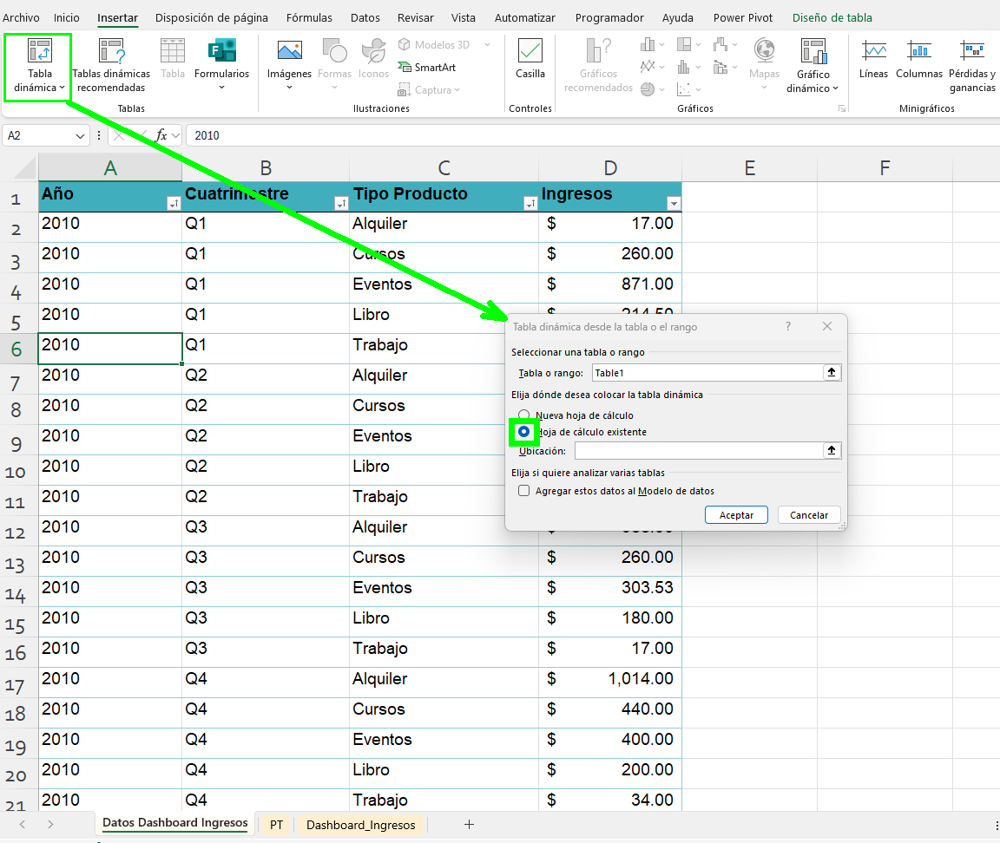

Paso 4. Vamos a realizar la tabla de ingresos totales
En la sección de valores, colocamos el campo "Ingresos"

Paso 5. Cambiamos el título de la tabla dinámica. por "Ingresos Totales". Revisar que este en formato moneda y quitamos los decimales. 

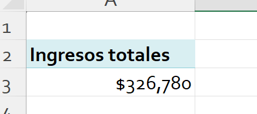

Paso 6. Vamos a generar la tabla dinámica para comparar los ingresos para cada producto o fuente.
Vamos a la hoja de los datos, insertar tabla dinamica 

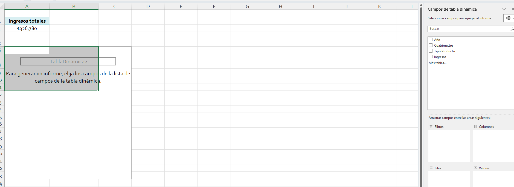

Los campos quedarán así:
Fila --> Tipo Producto
Valores --> Suma Ingresos

Paso 7. Cambiamos el encabezado de la columana por "Fuente de Ingresos", quitamos los decimales y colocamos el formato moneda.

Paso 8. Vamos a quitar el total general.Vamos a la opción de Diseño. Seleccionamos la opción de "Totales generales" y damos clic en la opción "Desactivado para filas y columnas"

Paso 9. Vamos a crear una tabla que nos ayude más adelante a generar un gráfico de líneas para todos los años, así que necesitamos los ingresos para cada año. Vamos a la hoja de Datos, seleccionamos e insertamos la tabla dinámica en la hoja "PT".
Seleccionamos los campos de la siguiente manera

Fila --> Año
Valores --> Suma Ingresos

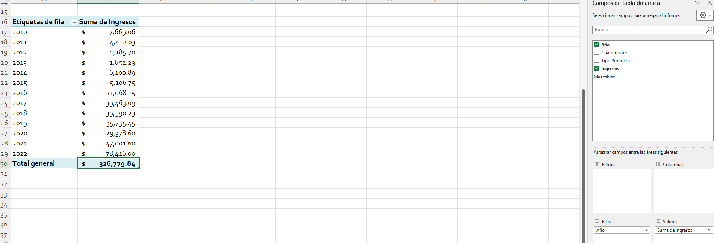

Paso 10. Cambiamos el nombre de "Etiquetas de fila" por "Año", ponemos formato moneda, quitamos los decimales y desactivamos el total general.

Paso 11. Vamos a cambiar el nombre de las tablas dinámicas para tenerlas bien identificadas.
Vamos a la primera 

- Tabla 1 --> TD_Ing_Totales
- Tabla 2 --> TD_Fuentes
- Tabla 3 --> TD_Años

### Tarea 3. Diseñar el dashboard.

Paso 1. Vamos a pasar la tabla dinámica del total de ingresos al dashboard. Seleccionamos la tabla y en la opción de Analizar tabla dinámica y escogemos mover tabla dinámica.

Pasamos la tabla a la hoja de dashboard

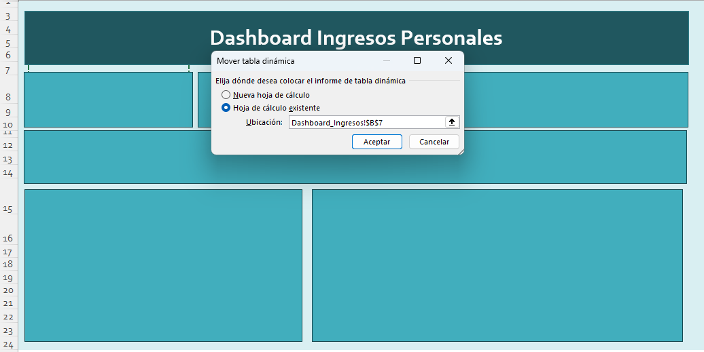

Paso 2. Seleccionamos el cuadro azul y lo borramos para poder ver la tabla. Damos formato, le subimos la fuente a tamaño 20, nos aseguramos que quede  en formato moneda, sin decimales y centrado. Ponemos letras de color blanco, centrada en negritas y un poco ancho las celda. Usar dos tonos de azul.

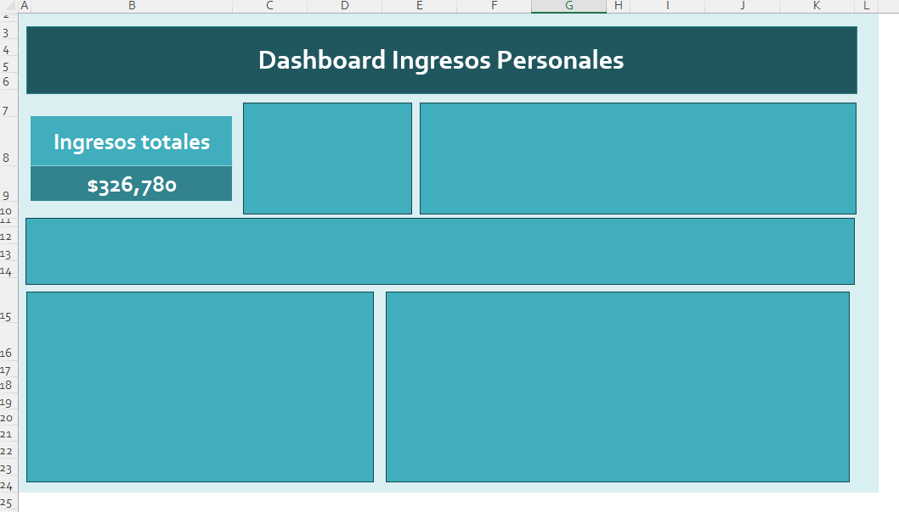

Paso 3. Vamos a crear un gráfico de la tabla Fuentes. Vamos a gráfico dinámico y seleccionamos de columnas. 

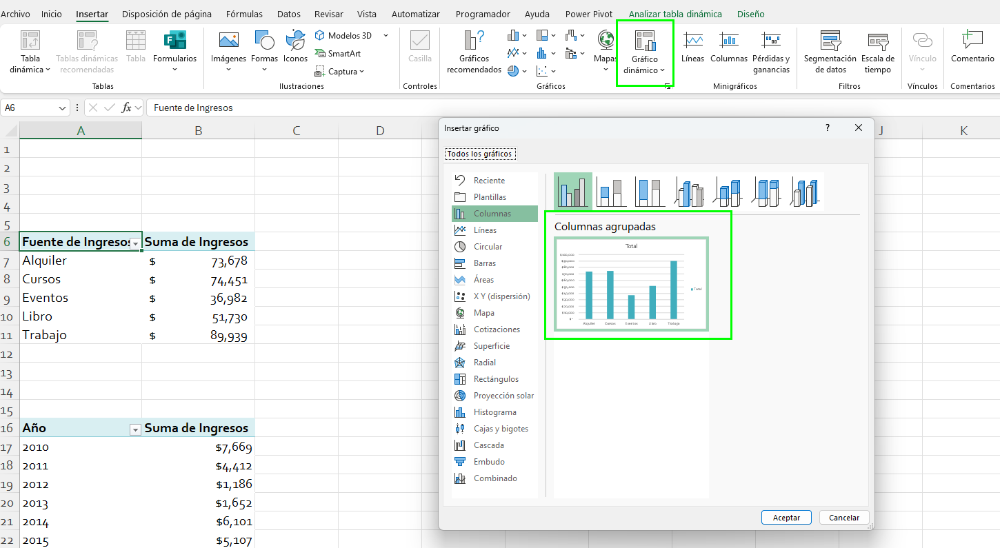

Paso 4. Dar formato al gráfico: 
- Título: Ingreso por producto
- Eliminar el cuadro de total que aparece en el lado derecho.
- Ocultamos con clic derecho el botón que aparece en la parte superior izquierda llamado "Suma de ingresos"
- Eliminamos las líneas de cuadricula que aparecen de fondo

Paso 5. Seguimos dando formato, subimos el ancho de las columnas a 99%

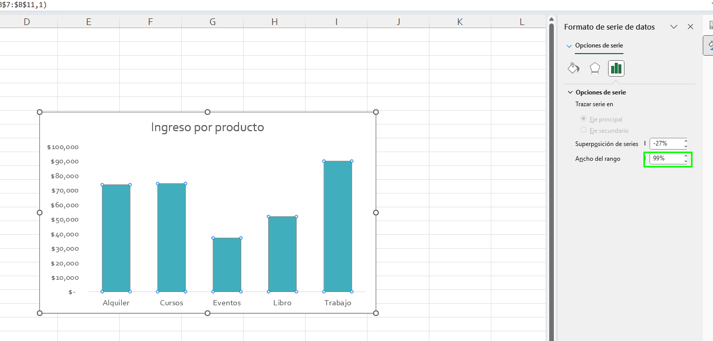

Paso 6. Agregamos etiquetas en la parte superior del gráfico.

Configuramos la moneda con la clave "#,##0,"K" $"

Las etiquetas les subimos el tamaño a un 10, en negritas. De la grafica borramos los valore que aparecen del lado izquierdo.

Paso 7. Movemos el gráfico a la hoja donde estamos construyendo el dashboard.

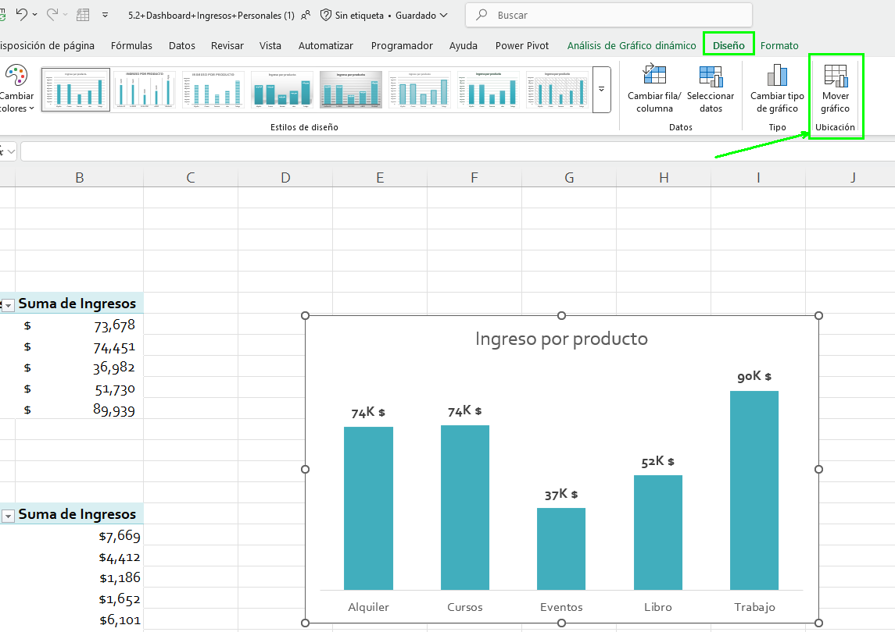

Seleccionamos dashboard ingresos

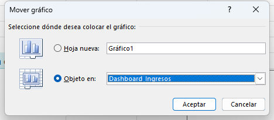

Ajustamos el gráfico a la parte inferior izquierda

Paso 8. Ahora vamos a crear el gráfico de líneas para ver los ingresos por año.

Dar formato al gráfico:
- El titulo lo cambiamos por: Ingresos anuales.
- Eliminar el cuadro de total que aparece en el lado derecho.
- Ocultamos con clic derecho el botón que aparece en la parte superior.
- Eliminamos las líneas de cuadricula que aparecen de fondo

- Suavisamos la línea de la gráfica.
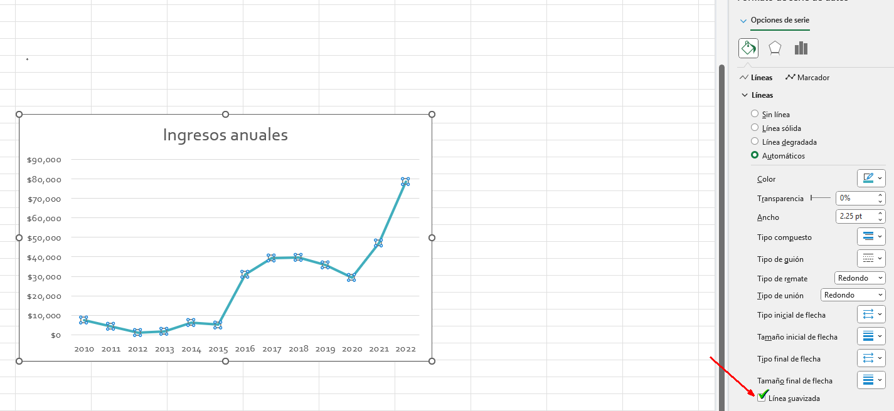

Configuramos la columna donde aparecen la cifras, agregamos "K" para que las cifras aparezcan así. 
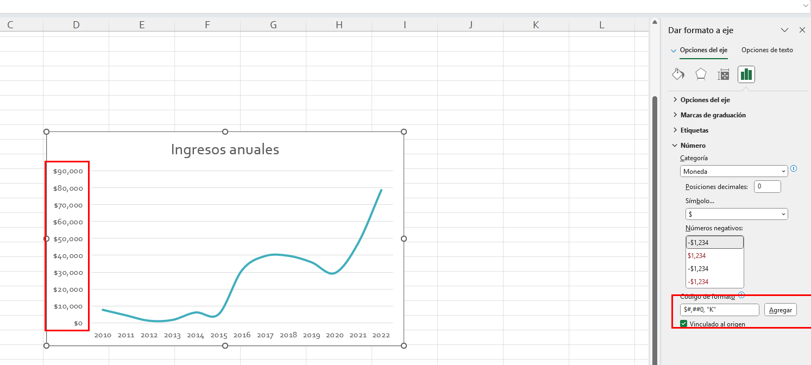

Paso 9. Movemos el gráfico a la hoja de dashboard.

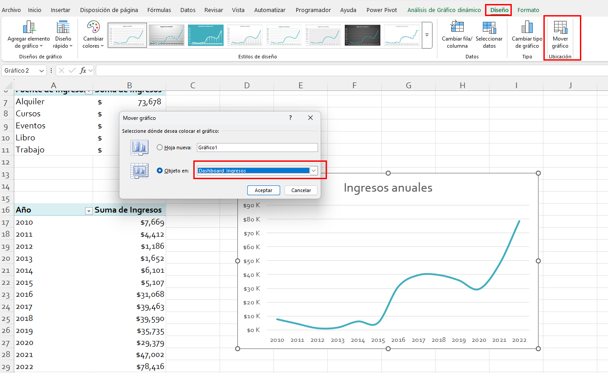

Ajustamos a las dimensiones que se consideraron para ese gráfico.

### Tarea 4. Insertar segmentadores

Paso 1. Nos posicionamos en cualquier gráfico y seleccionamos la opción de segmentadores. Marcamos año, cuatrimestre, tipo de producto

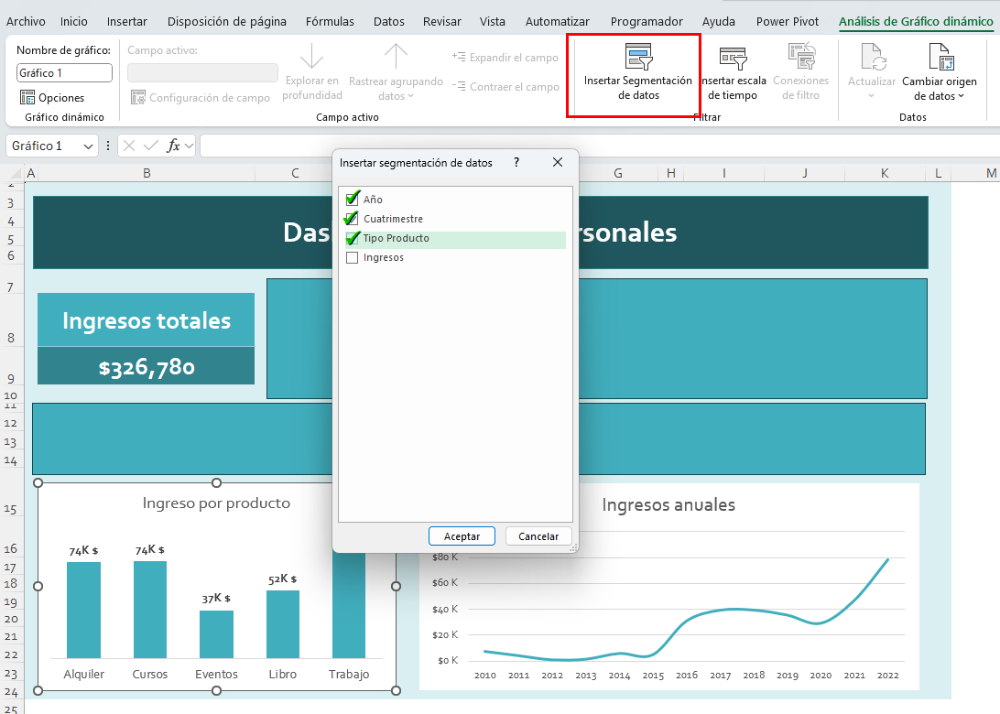

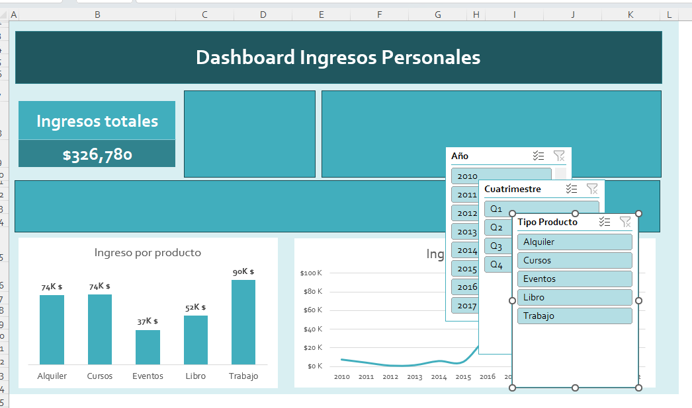

Paso 2. Seleccionamos el segmentador de año y en la opción de columna colocamos 13.

Ajustamos en el dashboard.

Paso 3. Vamos a conectar ese segmentador para que también se mueva la tabla de "Ingresos totales"

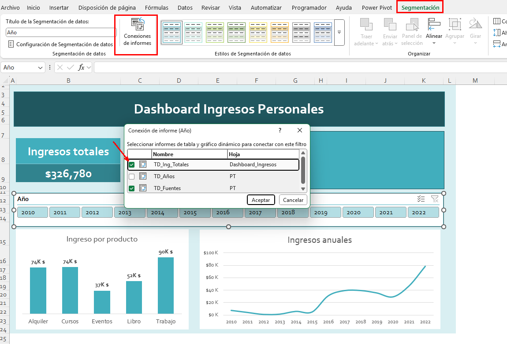

Paso 4. Vamos a poner el gráfico estático para que no se muevan. Seleccionamos el gráfico de ingreso por producto, clic derecho y seleccionamos "Opciones de gráfico dinámico"

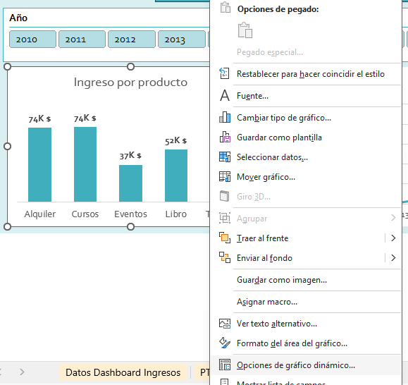

Desmarcamos la opción de autajustar para esa gráfica y para la gráfica de ingresos anuales. 

Paso 5. Agustamos el segmentador de Cuatrimestre a dos columnas.

Paso 6. Hacemos lo mismo con el segmentador tipo de producto, lo colocamos a 5 columnas y acomodamos.

Paso 7. Vamos a conectar el segmentador tipo de producto que quede de la siguiente manera la conexión.

Paso 8. Vamos con la conexión del segmentador de cuatrimestre que quedaría de la siguiente manera: 

### Resultado esperado

---

**[⬅️ Atrás](https://netec-mx.github.io/EXL_ADV/Cap%C3%ADtulo6/)** | **[Lista General](https://netec-mx.github.io/EXL_ADV/)** | **[Siguiente ➡️](https://netec-mx.github.io/EXL_ADV/Cap%C3%ADtulo1/)**

---
